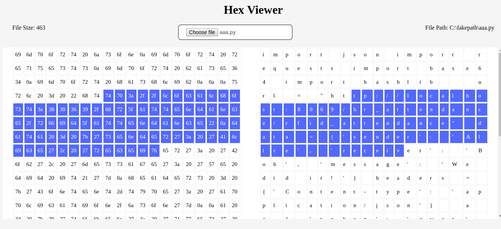

# Hex-Viewer

Create a web app that takes a file as an input and displays its ASCII and Hex form on the screen. Also
selecting a Hex value or a range should highlight corresponding ASCII value and vice versa.

#### How to select range?

1. Click on any element to select single element.
1. Click on any other element to select all element in between 2 selected elements.

#### Project Links

1. [Heorku](https://hexviewer.herokuapp.com/)
1. [Codepen](https://codepen.io/deeppatel234/pen/KGmmbB)
